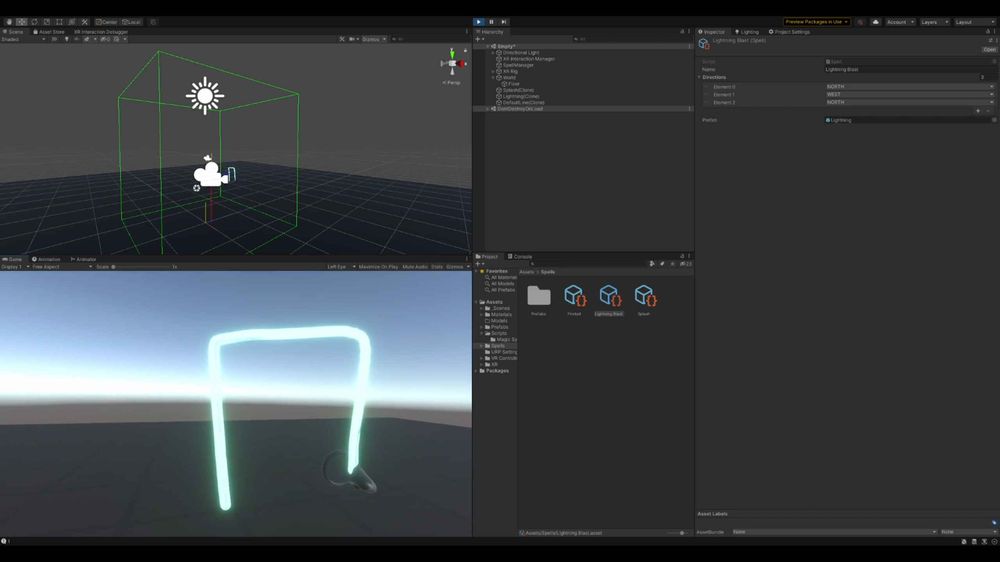

# VR Magic
Magic system designed for VR games.  Uses spells drawn in the air and a projection system to recognize what's being cast.

## Summary
Originally inspired by, amongst other things, the Pokemon Rangers guardian signs summons, I set out to build a procedural magic system for VR based around physically drawing symbols in the air.  Practically, this means allowing the user to draw a path when the trigger on their controller is pressed, extracting the 2D component from this path (as I recall, projection math was too complex for me, so I just used the camera's projection) and then matching the path to a set of pre-defined paths based around cardinal directions.  This allows for the recognition of semi-complex shapes and also a decent amount of flexibility in how long individual lines are drawn.  The limitations are that only straight lines are acceptable and that you can't effectively enforce minimum line lengths for individual strokes.

This project never made it past the "Fun Idea" phase and existed only within a unity project I can't seem to get working again.  If something intrigues you, please take the idea and run with it.

## Project Status
As much as I want to continue working on this, as I think the core concept of a procedural magic system sounds incredibly fun, I can't see a good way to turn it into a fun game mechanic.  Drawing the symbols in the air takes too much time for combat or for natural use in a living world, and sterile puzzles aren't something I'm interested in building.

I plan to eventually re-vitalize this project thanks to The Owl House and the inspiration it gave me to instead use symbols to imbue objects with magic.  That would likely make for a much more interesting and diverse set of mechanics, though also a lot harder to build.

Alternatively, I'd like to see if I can build a fully motion-based magic system akin to water-bending from Avatar: The Last Airbender.  This is, again, rather more difficult to code, but it would also be incredibly fun if it ever worked.

